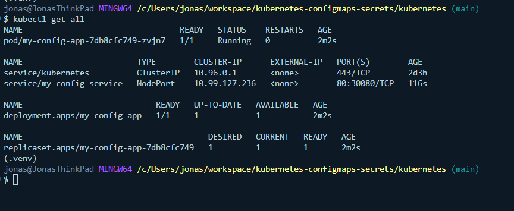
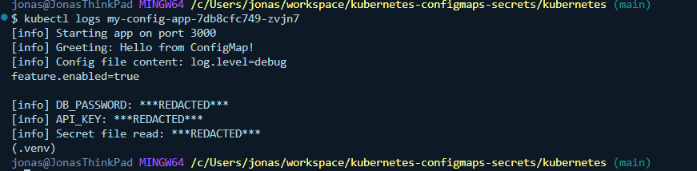
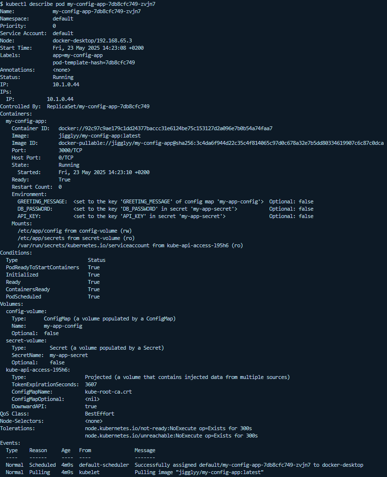

# Anwendungskonfiguration in Kubernetes: ConfigMaps & Secrets

Dieses Projekt demonstriert, wie man Konfigurationsdaten (sowohl nicht-sensible als auch sensible) in Kubernetes mithilfe von **ConfigMaps** und **Secrets** verwaltet. Ziel ist es, eine einfache Node.js-Anwendung zu deployen, die diese Daten liest und beim Start entsprechend loggt.

## 📦 Projektstruktur

```bash
.
├── backend/              # Node.js App mit Logging
│   ├── index.js
│   ├── Dockerfile
│   └── package.json
├── kubernetes/           # Kubernetes YAML-Definitionen
│   ├── app-configmap.yaml
│   ├── app-secret.yaml (anonymisiert!)
│   ├── app-deployment.yaml
│   ├── app-service.yaml
│   └── REFLEXION.md      # Schriftliche Beantwortung der Fragen
└── README.md             # Diese Datei
```

## 🚀 Anwendung starten

### Voraussetzungen

- Docker & kubectl installiert  
- Docker läuft  
- Lokales Kubernetes-Cluster (Minikube, Kind oder Docker Desktop) ist aktiv  
- `kubectl get nodes` funktioniert  
- Bei Docker Hub eingeloggt (`docker login`)  

---

### Schritte

#### 1. Image bauen und pushen

```bash
cd backend/
docker build -t jigglyy/my-config-app:latest .
docker push jigglyy/my-config-app:latest
```
### 2. Kubernetes Ressourcen anwenden

```bash
cd ../kubernetes/
kubectl apply -f app-configmap.yaml
kubectl apply -f app-secret.yaml
kubectl apply -f app-deployment.yaml
kubectl apply -f app-service.yaml
```
### 3. Deployment überprüfen
```bash
kubectl get all
kubectl get pods -l app=my-config-app
kubectl logs <pod-name>
```
## 📸 Screenshots

- **kubectl get all** – erfolgreiche Ressourcen-Erstellung  
  

- **kubectl logs <pod-name>** – zeigt gelesene Konfigurationswerte  
  

- **kubectl describe pod <pod-name>** – zeigt Volumes und ENV Vars (optional)  
  

## 🧠 Reflexionsfragen

### 1. Warum ist es eine Best Practice, Konfiguration und sensible Daten in Kubernetes getrennt von den Docker Images zu speichern?

Durch die Trennung wird sichergestellt, dass ein und dasselbe Docker-Image in verschiedenen Umgebungen (z. B. Entwicklung, Test, Produktion) verwendet werden kann. Außerdem erhöht es die Sicherheit, da keine Passwörter oder API-Schlüssel im Image selbst gespeichert werden. Das entspricht auch dem 12-Factor-Prinzip (Faktor III: Konfiguration), wonach Konfiguration immer extern verwaltet werden soll.

---

### 2. Was ist der Hauptunterschied im Zweck zwischen einer ConfigMap und einem Secret?

Eine `ConfigMap` ist für **nicht-sensitive** Konfigurationsdaten gedacht (z. B. Begrüßungstexte, Pfade, Log-Level), während ein `Secret` speziell für **sensible Informationen** wie Passwörter, Tokens oder API-Keys verwendet wird. Technisch speichert Kubernetes Secrets auch verschlüsselt (bzw. Base64-kodiert) und behandelt sie restriktiver im Zugriff.

---

### 3. Beschreibe die zwei Hauptarten, wie du Konfiguration (sowohl aus ConfigMaps als auch Secrets) für einen Container in einem Pod bereitstellen kannst.

Es gibt zwei Hauptwege, wie Konfigurationswerte aus ConfigMaps oder Secrets einem Container zur Verfügung gestellt werden können:

Erstens über Umgebungsvariablen: Dabei wird der Wert direkt als Umgebungsvariable in den Container geladen und kann von der Anwendung über Umgebungszugriffe gelesen werden (z. B. `process.env` in Node.js).

Zweitens über gemountete Dateien: Dabei werden die Inhalte von ConfigMaps oder Secrets als Dateien in ein bestimmtes Verzeichnis im Container eingebunden. Die Anwendung kann dann auf die Datei zugreifen und die enthaltenen Werte einlesen. Diese Methode eignet sich besonders gut für sensible Daten, da sie gezielter abgesichert und einfacher aktualisiert werden kann.

---

### 4. Welchen Weg (ENV Var oder gemountete Datei) würdest du für ein kritisches Datenbank-Passwort in Produktion bevorzugen und warum?

Für die Bereitstellung eines sensiblen Werts wie eines Datenbank-Passworts in einer Produktionsumgebung würde ich den Weg über eine gemountete Datei klar bevorzugen. Der Hauptgrund liegt in der höheren Sicherheit: Umgebungsvariablen sind zwar einfach zu verwenden, aber sie können unter bestimmten Umständen leicht ausgelesen werden – beispielsweise über das `/proc`-Verzeichnis innerhalb des Containers, über Tools zur Prozessinspektion oder durch unbeabsichtigtes Logging in der Anwendung.

Gemountete Dateien, insbesondere aus einem Kubernetes Secret, bieten hier eine sicherere Alternative. Sie erscheinen als temporäre Dateien im Container-Dateisystem und können mit restriktiven Dateirechten versehen werden. Außerdem lassen sich Secrets, die als Dateien gemountet werden, einfacher rotieren oder aktualisieren – ohne dass der Container neu gestartet werden muss, da Kubernetes das Volume automatisch aktualisieren kann.

Zusätzlich ist es bei einer Datei einfacher, das Logging so zu gestalten, dass der Inhalt nicht versehentlich ausgegeben wird, da der Zugriff gezielt über Dateioperationen erfolgt. Insgesamt ergibt sich dadurch ein deutlich robusteres Sicherheitskonzept, was besonders bei produktiven Anwendungen mit echten Nutzerdaten entscheidend ist.

---

### 5. Deine Secret YAML Datei sollte nicht in ein öffentliches Git-Repository eingecheckt werden. Warum ist das Feld `stringData:` in der Secret-Definition zwar praktisch, aber auch ein Grund für diese Vorsicht?

Das Feld `stringData:` in einer Kubernetes Secret-Definition ist besonders praktisch, weil es ermöglicht, Klartextwerte direkt in die YAML-Datei einzutragen, ohne sie vorher in Base64 kodieren zu müssen. Das macht die Erstellung von Secrets im Entwicklungsprozess deutlich einfacher und beschleunigt das Testen, da man auf externe Tools zur Kodierung verzichten kann.

Genau diese Bequemlichkeit bringt jedoch auch ein hohes Sicherheitsrisiko mit sich: Wenn eine solche YAML-Datei mit sensiblen Klartextdaten – etwa Passwörtern, Tokens oder API-Schlüsseln – versehentlich in ein öffentliches Git-Repository eingecheckt wird, sind diese Daten sofort und dauerhaft öffentlich zugänglich. Selbst wenn der Commit später gelöscht wird, könnten Dritte die Daten bereits über Mirror-Dienste oder die Git-Historie abrufen.

Daher ist es extrem wichtig, mit `stringData:` vorsichtig umzugehen. Solche Dateien sollten niemals in ein öffentliches Repository gelangen. Stattdessen sollten sie entweder vollständig ignoriert werden (zum Beispiel durch einen Eintrag in `.gitignore`) oder nur mit Platzhaltern und ohne echte Werte versioniert werden. Für Produktionsumgebungen empfiehlt sich außerdem die Nutzung sicherer Deployment-Methoden, bei denen die sensiblen Daten zur Laufzeit eingebracht und nicht im Quellcode mitgeführt werden.

---